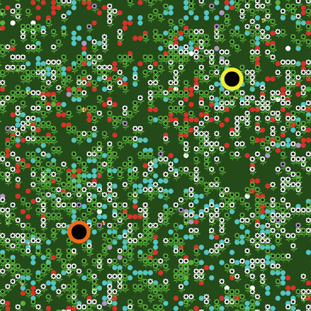
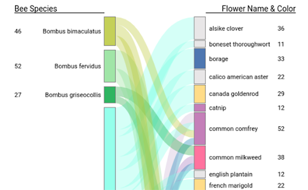

## Project Title
Simulating Invasive Hives

# Authors
Gavin Barro and Austin Earl

# About
As a part of our final project for ISAT 441, we decided to simulate the effect of invasive hives on local ecosystems

# Problem Statement
This project involved simulating a dynamic hive, flower, and bee ecosystem to explore how nectar availability influences 
the production and survival of both bees and flowers, while ensuring a sustainable balance between resource consumption 
and regeneration. To deepen our analysis, we developed two versions of this ecosystem: one featuring only native flower 
species and another incorporating an invasive flower species. By comparing the two models, we aimed to uncover the effects
of invasive species on resource competition among flowers, the sustainability of bee hives, and the overall health and 
resilience of the ecosystem. This approach allowed us to examine how changes in species composition can disrupt ecological
equilibrium and impact long-term sustainability.

# Problem Significance
The ease and frequency of global transportation have significantly increased the movement of species across geographic boundaries,
often leading to the unintended introduction of invasive species into new ecosystems. Additionally, human development of previously
untouched areas disrupts the balance of existing ecosystems, creating opportunities for non-native species to establish themselves. 
Invasive species such as Japanese Switchgrass, Burmese pythons, and Spotted Lanternflies exemplify this growing ecological challenge. 
These species outcompete native flora and fauna for resources, disrupt food webs, and compromise biodiversity, ultimately threatening 
the sustainability of the ecosystems they invade[1]. Understanding and mitigating the impacts of invasive species are critical to 
preserving ecological health and ensuring the resilience of both natural and human-altered environments.

# Conceptual Model
Our conceptual model draws inspiration from the Beecology Project[2], which addresses the alarming decline in wild pollinators, 
focusing on their abundance, diversity, and geographic distribution. This decline poses a critical threat to ecosystem health and 
biodiversity, with insufficient ecological data hampering effective conservation efforts. The Beecology Project engages citizen 
scientists to collect and submit data on native pollinators through innovative smartphone and web apps, complemented by online 
visualization tools designed for diverse users, including researchers, educators, and conservation groups. By analyzing bumblebee-plant
interactions and later expanding to nesting and overwintering behaviors, the project seeks to enhance pollinator habitats and identify 
the causes of their decline. Using this as a foundation, our model adapts key aspects of their approach, emphasizing ecosystem dynamics 
and species interactions, while tailoring the focus to study the impacts of invasive species on resource competition and ecological 
sustainability. This alignment allowed us to leverage proven methodologies while addressing a unique aspect of ecosystem health.

They chose to simulate a pollination ecosystem involving different types of bees, flowers, and an invasive flower species. Their model
included four different breeds: seeds, flowers, hives, and bees, each with specific properties to represent their behavior like nectar 
collection, pollination, and reproduction. Bees forage for nectar and pollen and flowers bloom and reproduce via seeds, and hives serve
as storage for collected nectar. The environment is also modeled with areas that contain seeds that directly influence where flowers grow.
Their simulation also includes adjustable parameters such as bee preferences, nectar regeneration rates, and flower lifespans to study how
these factors share the ecosystem.

Three scenarios are predefined in their model to explore different ecological outcomes. In the baseline scenario, invasive flowers fail to
dominate the ecosystem. In the second scenario, invasive flowers outcompete the native species due to high bee preferences and overlapping
bloom times. In the third scenario, bees of one species favor invasive flowers, leading to competitive displacement of the other bee species.
This model allows users to study pollination dynamics, the impact of invasive species, and how species-specific preferences influence 
biodiversity and ecosystem stability.

*Figure 1: An example of their simulation*

*Figure 2. Various bee species and flower they chose to model*

# Computational Model
Our computational model simulates an ecosystem comprising bees, hives, and multiple flower species, including both native and invasive varieties.
The model focuses on key interactions such as nectar collection, hive resource dynamics, and the life cycles of flowers and bees. Bees forage for 
nectar, contributing to hive resources, while flowers regenerate and reproduce, creating a dynamic interplay between species. These interactions 
form the foundation for exploring ecological relationships and the impact of invasive species within a simplified yet robust framework.

To streamline the simulation, we introduced several simplifying assumptions. Nectar regeneration occurs at a fixed rate, and external factors such
as weather, seasons, and climate changes are excluded from the model. Hive dynamics are influenced solely by nectar collection, omitting other 
potential factors like pollen. These simplifications allowed us to concentrate on the core processes shaping the ecosystem while ensuring the model 
remains computationally efficient and focused on the primary ecological dynamics.[3]

The primary differences between the two simulations lie in their complexity and focus. The first simulation emphasizes generalized interactions 
between agents, such as movement patterns and satisfaction based on neighborhood characteristics. This model explores social dynamics and emergent 
patterns by simulating the movement of agents with varying preferences. In contrast, the second simulation incorporates a more specific ecological 
system involving bees, hives, and flowers. It emphasizes biological and ecological processes like nectar collection, resource dynamics, and species 
interactions, providing a focused exploration of ecological relationships and the potential impact of invasive species.

The changes between the two simulations were made to tailor the model to different research goals. The first model makes it well-suited for studying 
broad social behaviors or spatial segregation patterns. The second model aims to capture biological realism, allowing for more nuanced exploration of 
ecological systems. These changes were driven by a need to align the model's scope with specific research questions, such as understanding invasive 
species' ecological impacts or the interplay between resource dynamics and species survival. The transition from a general agent-based framework to a 
detailed ecological model reflects a shift in focus from abstract interactions to domain-specific processes.

The code defines a simulation ecosystem consisting of flowers, bees, and hives. The Flower class models various types of flowers, tracking their age, 
species, nectar levels, and seed production, with methods to update nectar, produce seeds, and age the flower. The Hive class represents a hive, managing 
bees, nectar storage, and the seasonal cycle, with methods for storing nectar. The Bee class models individual bees, keeping track of their age, species, 
nectar collection, and movement between flowers and hives. Bees visit flowers to collect nectar, which is then stored in the hive. They can also age and 
eventually die. The WeightedEcosystem class ties everything together, running a simulation where bees visit flowers, collect nectar, and store it in hives 
while tracking the population of different flower species and the amount of nectar in the hives over multiple iterations. The ecosystem includes multiple 
flower species, such as invasive flowers and various colored flowers, and simulates the interactions between bees, flowers, and hives to observe changes 
over time. The simulation runs for a set number of iterations, collecting data to plot the results of the ecosystem's dynamics.

We will discuss the results of our simulations below.

# Results
Our results section is broken up into two categories, based on our two simulations: Random Flower Selection, where there is no invasive species and 
Weighted Flower Selection, where there is an invasive species.

# Acknowledgements

